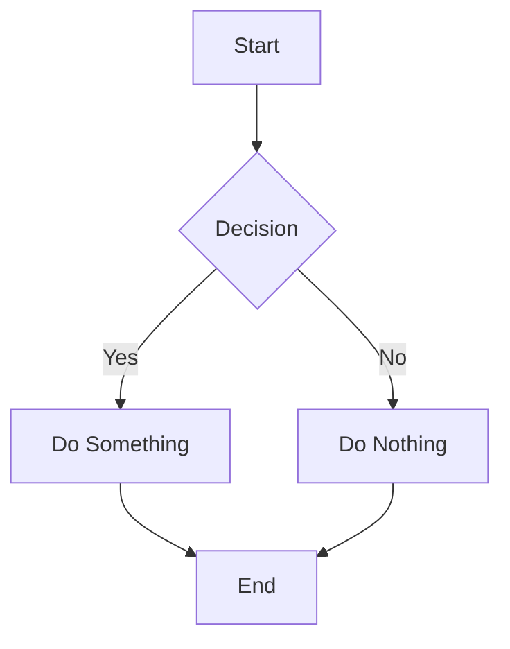

This site is published from https://github.com/flowershow/demo using [Flowershow](https://flowershow.app). You can check all the underlying markdown and source code in that repo and see the resulting website powered by Flowershow live online at https://demo.flowershow.app/.

## 🎯 What's Inside?

This demo showcases various Flowershow features and configuration options:

- 📝 **Rich Markdown Support**
    - Tables, code blocks, and diagrams
    - Math equations and LaTeX
    - Callouts and blockquotes
    - Obsidian wiki-links
    - …and more!
- 🎨 **Customization Options**
    - Comments
    - Navigation setup
    - Custom domains

## 📚 Markdown Syntax

### Text Formatting

**Bold text**, *italic text* and ***bold italic text***
~~Strikethrough text~~
`Inline code`
==Highlighted text== (🚧 [issue #894](https://github.com/flowershow/flowershow/issues/894))

### Lists

Unordered list:
* Item 1
* Item 2
  * Nested item 2.1
  * Nested item 2.2
* Item 3

Ordered list:
1. First item
2. Second item
   1. Nested item 2.1
   2. Nested item 2.2
3. Third item

### Task Lists

- [x] Completed task
- [ ] Incomplete task
- [ ] Another task
  - [x] Nested completed task
  - [ ] Nested incomplete task

### Code Blocks

Inline code: `const greeting = "Hello, World!";`

```javascript
// JavaScript example
function calculateSum(a, b) {
  return a + b;
}
const result = calculateSum(5, 3);
console.log(result); // Output: 8
```

```python
# Python example
def greet(name):
    return f"Hello, {name}!"
print(greet("Flowershow"))
```

### Tables

| Book Type | Average Length | Reading Time |
|-----------|---------------|--------------|
| Novel | 300 pages | 5 hours |
| Magazine | 50 pages | 1 hour |
| Comic Book | 30 pages | 30 minutes |
| Cookbook | 200 pages | 2 hours |

### Blockquotes

> Single line quote

> Multi-line quote
> with multiple paragraphs
> > Nested quote
> > > Deeper nested quote

### Links & Embeds

Markdown link:
```md
[Visit Flowershow](https://flowershow.app)
```
→ [Visit Flowershow](https://flowershow.app)

Image embed:
```md

```
→


### Obsidian Wiki-links

Flowershow supports **Obsidian-style wiki-links** too.

**Link by shortest-possible path:**
```md
[[Lorem ipsum]]
```
→ [[Lorem ipsum]]

**Link by full path:**
```md
[[blog/Lorem ipsum]]
```
→ [[blog/Lorem ipsum]]

**Use an alias:**
```md
[[Lorem ipsum|Alias]]
```
→ [[Lorem ipsum|Alias]]

**Embed images with the same syntax:**
```md
![[hiroshige-2.jpg]]
```
→ 
![[hiroshige-2.jpg]]
### Math Equations

```
Lift($$L$$) can be determined by Lift Coefficient ($$C_L$$) like the following
equation.

$$
L = \frac{1}{2} \rho v^2 S C_L
$$
```

Lift($$L$$) can be determined by Lift Coefficient ($$C_L$$) like the following
equation.

$$
L = \frac{1}{2} \rho v^2 S C_L
$$

### Mermaid Diagrams



### Obsidian Callouts

> [!NOTE]
> This is a note callout

> [!WARNING]
> This is a warning callout

> [!BUG]
> This is a bug callout

> [!IMPORTANT]
> This is an important callout

### Footnotes

Here's a sentence with a footnote[^1].

[^1]: This is the footnote content.

## ⚙️ Customization Options

For detailed information about all customization options, visit [Flowershow Documentation](https://flowershow.app/docs).

### Navigation

The site's navigation elements including the **logo**, **title**, **links**, and **social media buttons** have been configured using the [`config.json`](https://github.com/flowershow/demo/blob/main/config.json) file.

In addition, you can enable a **full-text search field** directly from the Flowershow Cloud dashboard. When enabled, it appears in the navigation bar and lets visitors quickly find content across your site.

### Dark/Light Theme Switch

This site includes a theme toggle in the navigation bar, allowing visitors to switch between light and dark modes. The toggle can be enabled and customized through the [`config.json`](https://github.com/flowershow/demo/blob/main/config.json) file. You can set the default theme (light, dark, or system preference) and control whether the toggle appears in the navbar.

### Hero

The hero component at the top of this page is set using the `showHero` frontmatter property. It You can set it's title, description, image and call-to-action buttons.

### Edit This Page Link

At the bottom of each page you may notice an **“Edit this page”** link. When enabled, it points directly to the corresponding Markdown file in your GitHub repository. This makes it simple for you—or your readers and collaborators—to suggest changes and improvements.
### Comments

The comments section you can see at the bottom of this page has been enabled through the Flowershow Cloud dashboard. This feature allows your readers to engage with your content and provide feedback directly on your pages.

### Custom Domain

Looking at the URL of this site, you'll notice it's available at a custom domain instead of the default Flowershow Cloud URL pattern (`/@username/sitename`). This is another customization option available through the Flowershow Cloud dashboard, allowing you to use your own domain name for a more professional appearance.

## 🤝 Contributing

Have a suggestion? Feel free to:
1. Open an issue
2. Submit a pull request
3. Start a discussion

---

*Built using [Flowershow](https://flowershow.app)*
